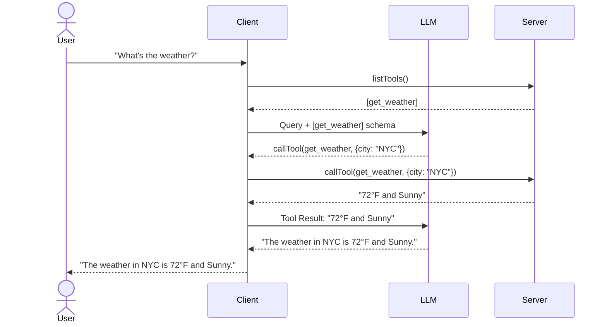

# MCP Client Development

Building an MCP Client (the "Host" in the [[mcp-architecture|MCP model]]) involves managing connections to servers, listing their capabilities, and orchestrating interactions between an LLM and those capabilities.

## High-Level Workflow
1.  **Initialize Transport**: Set up communication (Stdio or HTTP/SSE).
2.  **Handshake**: Call `initialize` to negotiate protocol version and capabilities.
3.  **Discovery**: Call `listTools`, `listResources`, and `listPrompts`.
4.  **Orchestration**:
    *   Send the user query + tool definitions to the LLM.
    *   If the LLM requests a tool call, the Client executes `callTool` on the Server.
    *   Return the tool result to the LLM.
    *   The LLM provides a final natural language response to the user.

## Core Implementation Patterns

### 1. Connection Management
Clients must handle the lifecycle of the server process (if using stdio).
*   **Python**: Use `AsyncExitStack` for robust cleanup.
*   **TypeScript**: Use `StdioClientTransport`.

### 2. Capability Negotiation
During `initialize`, the Client and Server exchange capability objects. The Client can offer:
*   **Sampling**: Giving the Server access to its LLM.
*   **Roots**: Informing the Server about accessible filesystem paths.

### 3. Tool Execution Loop
The Client acts as the "middleman" between the LLM and the Server:

## Best Practices
*   **Approval Gatekeeping**: Always prompt the user before executing tools that have side effects (e.g., deleting files, sending emails).
*   **Error Handling**: Wrap tool calls in try-catch blocks. If a server crashes, the client should attempt to restart it or notify the user gracefully.
*   **Timeout Management**: Large resource reads or complex tool executions may require custom timeout settings.

---
## References
* Source: `00_Raw/mcp/Build an MCP Client.md`
* [[mcp-client-features]]
* [[mcp-sdks]]
* [[mcp-architecture]]
