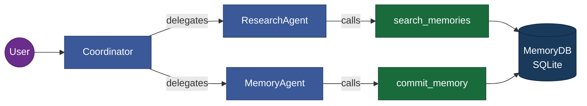
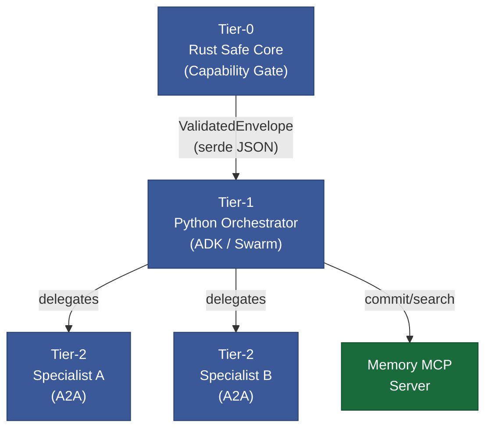
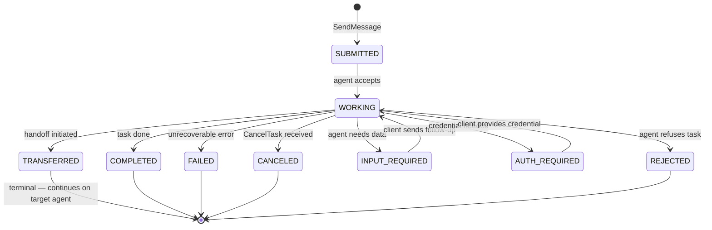
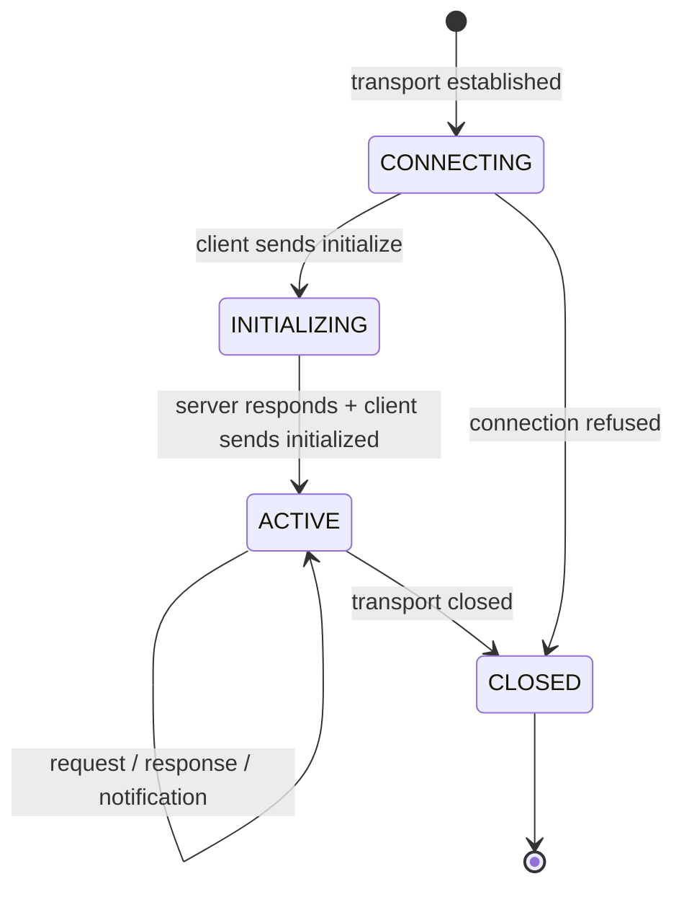
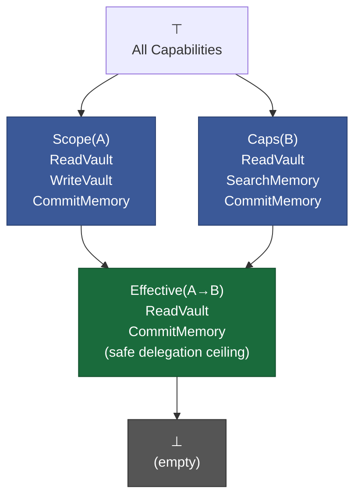
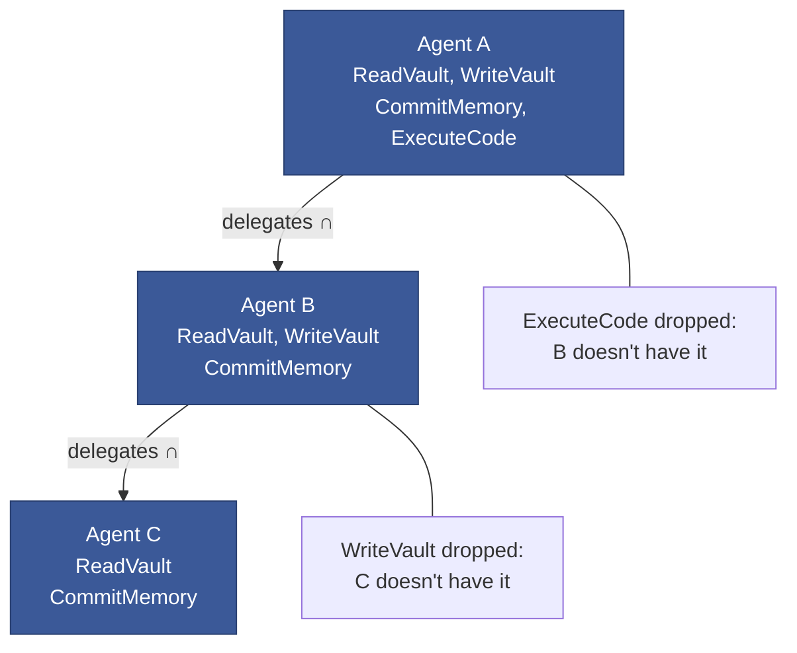
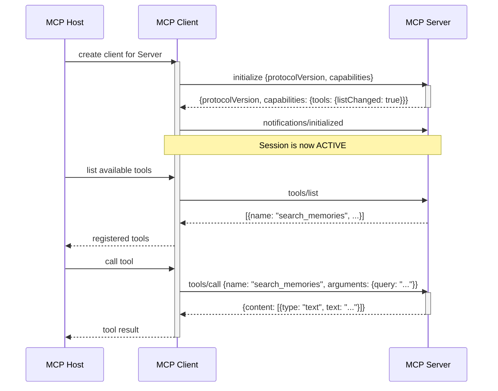
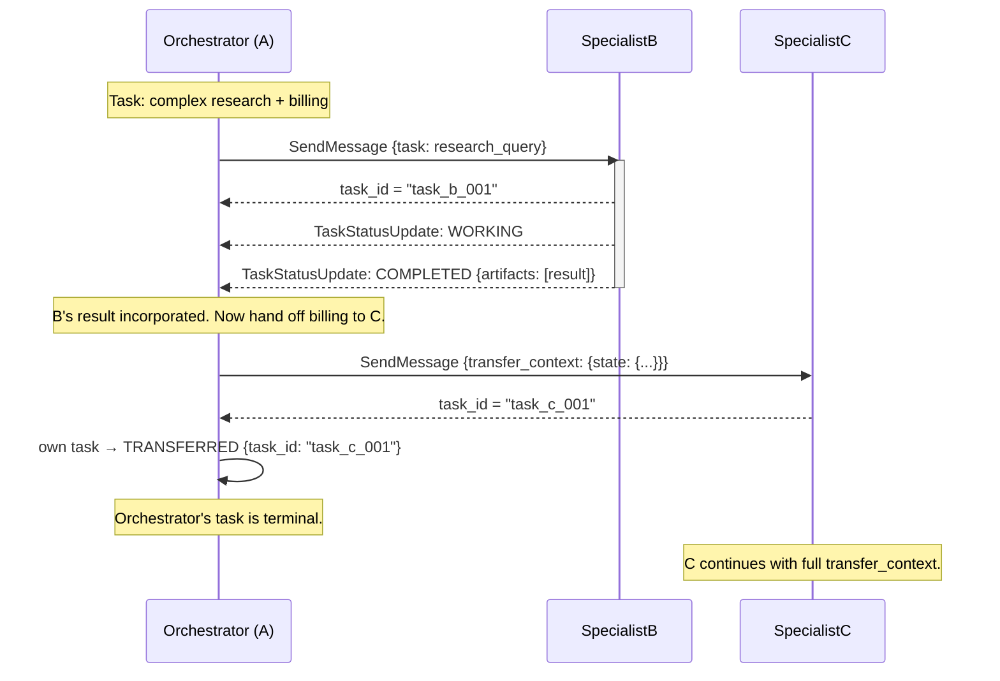

# Spec: Visual Vault Language

**Purpose:** Define a standard for representing the Vulture Nest's architecture visually using Mermaid.js — the text-based diagramming format natively rendered by Obsidian. A shared visual language lets agents generate diagrams that humans can read, and humans can edit diagrams that agents can parse back into structured knowledge.

All diagrams in the vault are **first-class content**, not decorations. They should encode information not easily expressed in prose and should be kept in sync with the notes they illustrate.

---

## 1. General Standards

### 1.1 Placement
- Diagrams live inline in the note they illustrate, under the H2 section they describe.
- A note should have at most **one diagram per H2 section** — if more are needed, split the section.
- Standalone diagram notes (e.g., a complex architecture overview) use `type: spec` and title prefix `Diagram:`.

### 1.2 Comment Header
Every diagram block must open with a Mermaid comment identifying its type and purpose:

````markdown
```mermaid
%% [diagram-type]: Brief description of what this diagram shows
```
````

Valid `diagram-type` values: `flowchart`, `stateDiagram`, `sequenceDiagram`, `lattice`, `classDiagram`.

### 1.3 Consistent Class Styling
All diagrams share this standard class palette. Include the relevant `classDef` lines at the bottom of every Mermaid block that uses them:

```
classDef agent      fill:#3b5998,color:#fff,stroke:#2a4070
classDef tool       fill:#1a6b3c,color:#fff,stroke:#114d2b
classDef external   fill:#7a4500,color:#fff,stroke:#5a3300
classDef human      fill:#6b2d8b,color:#fff,stroke:#4d1f66
classDef store      fill:#1a3a5c,color:#fff,stroke:#0f2440
classDef error      fill:#8b1a1a,color:#fff,stroke:#5c1010
classDef terminal   fill:#555,color:#fff,stroke:#333
```

| Class | Use for |
|---|---|
| `agent` | LLM agents, orchestrators, specialist agents |
| `tool` | MCP tools, function tools, API endpoints |
| `external` | External services, third-party APIs |
| `human` | Human actors in HITL patterns |
| `store` | Databases, memory stores, file systems |
| `error` | Error states, failure paths |
| `terminal` | Terminal states in state machines |

---

## 2. Pattern: Relationship Mapping (Flowcharts)

Use `flowchart LR` (left-to-right) for agent orchestration and tool call diagrams. Use `flowchart TB` (top-to-bottom) for hierarchy and tier architecture diagrams.

### 2.1 Agent Orchestration (LR)

Shows which agents call which other agents or tools, and the nature of each interaction.

**Edge label vocabulary:**

| Label | Meaning |
|---|---|
| `delegates` | [[pattern-dynamic-delegation]] — A calls B, waits, retains ownership |
| `hands off` | [[pattern-progressive-handoff]] — A transfers ownership to B |
| `reads` / `writes` | Data access to a store |
| `calls` | Tool invocation (not agent) |
| `fans out` | [[pattern-parallel-fan-out]] — simultaneous dispatch |
| `escalates` | [[pattern-human-in-the-loop]] — pause for human input |

**Example — Memory MCP delegation chain:**
````markdown

````

**Rendered:**


### 2.2 Tier Architecture (TB)

Shows the layered architecture of the system, reading top-to-bottom from most abstract to most concrete.

**Example — Three-tier Rust/Python/Agent stack:**
````markdown

````

---

## 3. Pattern: State Machines

Use `stateDiagram-v2` for lifecycle diagrams. Always show all terminal states and all non-happy-path transitions.

### 3.1 Rules

- Start state: `[*] --> FirstState`
- Terminal states: `SomeState --> [*]`; apply `:::terminal` class
- Error paths: use `:::error` class on FAILED / REJECTED states
- Include the triggering condition on every transition arrow: `StateA --> StateB: trigger`
- Keep state names in SCREAMING_SNAKE_CASE to match protocol definitions

### 3.2 Example — A2A Task Lifecycle

````markdown

````

**Rendered:**


### 3.3 Example — MCP Connection Lifecycle

````markdown

````

---

## 4. Pattern: Lattice Visualization

Use `flowchart TB` for lattice diagrams. The lattice reads top-to-bottom: **⊤ (all capabilities)** at the top, **⊥ (empty)** at the bottom. Intermediate nodes are capability sets; edges represent the subset relation (down = narrower).

### 4.1 Rules

- Top node is always `TOP["⊤\n(all capabilities)"]`
- Bottom node is always `BOT["⊥\n(empty set)"]`
- Each intermediate node label lists the capability set members
- Edges flow downward (TB) — upper node is a superset of lower node
- The **meet** (∩) of two sibling nodes is their shared lower bound
- Annotate meet/join operations with edge labels when showing a specific delegation

### 4.2 Example — Delegation Meet Operation

Shows how `Effective(A → B) = Caps(B) ∩ Scope(A)`:

````markdown

````

**Rendered:**


### 4.3 Example — Monotone Delegation Chain

Shows that capability can only narrow through a chain of delegations:

````markdown

````

---

## 5. Pattern: Sequence Diagrams (Protocol Handshakes)

Use `sequenceDiagram` for multi-party protocol interactions where order and timing matter. Essential for MCP lifecycle and A2A task flows.

### 5.1 Rules

- Participants listed left-to-right in order of initiation
- Use `activate` / `deactivate` to show blocking waits
- Mark async responses with `-->>` (dashed arrow)
- Use `Note over` for important protocol facts
- Keep to ≤ 8 participants; split complex flows across multiple diagrams

### 5.2 Example — MCP Initialize Handshake

````markdown

````

### 5.3 Example — A2A Delegation + Handoff

````markdown

````

---

## 6. Agent Generation Guidelines

When an agent generates a diagram (e.g., as part of a community report or spec):

1. **Choose the type:** Flowchart for relationships/tiers, StateDiagram for lifecycles, Lattice for capability sets, Sequence for protocol flows.
2. **Apply the comment header** with diagram-type and purpose.
3. **Use the standard class palette.** Copy the `classDef` lines from this spec.
4. **Test in Obsidian** (or render via `mmdc` CLI) before committing. Mermaid syntax errors are silent in some renderers.
5. **Link the diagram's note** with a wikilink from the note it illustrates: `See diagram in [[spec-visual-vault-language]]`.
6. **Keep diagrams current.** When a note's content changes materially, update its diagrams. Stale diagrams are worse than no diagrams — they mislead.

---

## References
- [[a2a-protocol]] — source for state machine examples
- [[lit-mcp-architecture]] — source for MCP lifecycle sequence
- [[capability-lattice-spec]] — source for lattice examples
- [[rust-tier-0-patterns]] — source for tier architecture diagram
- [[pattern-dynamic-delegation]]
- [[pattern-progressive-handoff]]
- [[pattern-capability-gating]]
- [[agent-note-conventions]]
- [[system-index]]
